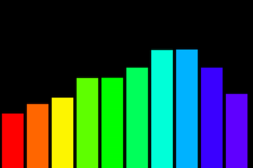
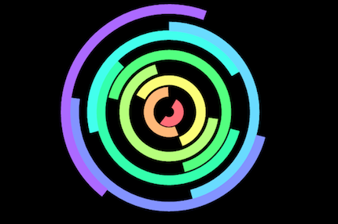
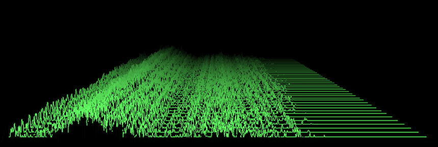

# Homework 2: Music Visualizer

The goal of this homework is designing a music visualizer that maps audio representations or their features (e.g. waveform, spectrum, energy, sub-band energy, pitch and so on) to graphical animations. Some historical backgrounds are explained below:

[Wikipedia: Music Visualization](https://en.wikipedia.org/wiki/Music_visualization)

[Wikipedia: Atari Video Music](https://en.wikipedia.org/wiki/Atari_Video_Music)

## Step #1: Reading
- Go to the https://p5js.org/ and read the "start" and "learn" sections. Also, check out the "examples" section. 
- You can learn more about graphics and interaction from https://processing.org/.

## Step #2: Ideation
- You can start with our course examples (subband level meter and web-sndpeek) and modify them. 
- you can freely map various audio features to graphical elments. 
- You can also add user input (e.g. keyboard or mouse) to make it more interactive. 

The following examples might provide you with some inspiration:

- https://github.com/willianjusten/awesome-audio-visualization
- https://codepen.io (query with "sound visualization" or "music visualization")
- https://www.openprocessing.org/
- https://preziotte.com/partymode/
- http://mattdesl.github.io/polartone/
- http://mdn.github.io/violent-theremin/
- https://airtightinteractive.com/demos/js/reactive/

## Step #3: Your visualization and deliverable
- Make your own music visulizer, using web audio, canvas or p5.js,  
- If you referred to any examples or got some ideas, please cite them in the bottom of your webpage.    
- Submit your work to https://your_id.github.io/ctp431/hw2/
- Have fun with it!

