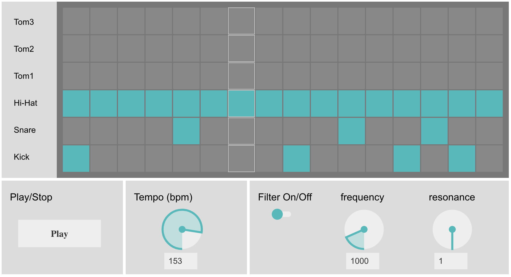

# Homework 3: Rhythm Machine

The goal of this homework is making a TR-808 style rhythm machine that generates various rhythmic patterns of electronic drum sounds based on a step sequencer. The starter code is provided so that you can easily work on it. To begin with it, remove the "_starter" suffix from "hw3_starter.html" file (That is, your working file will be "hw3.html"). 

## Step #1: Embedding Sound Synth 
The GUI part is already implemented using [NexusUI](https://nexus-js.github.io/ui/) in hw3.html. Your first job is integrating a synth engine into the GUI. For the synth part, we are going to re-use the TR-808 example from the CTP431 [Session #3](https://github.com/juhannam/ctp431-2018/tree/master/session3) in the following steps:

- Find "tr808.js" and save the file as "hw3.js" in your homework folder. 
- Uncomment the drum sample triggering funcstions (play_kick(), play_snare(), play_close_hihat(), ...) inside the "sequencer.on" listener in hw3.html.  
- Push the "play" button on the GUI and make sure the step sequencer makes sound.

## Step #2: Tempo Control
You can adjust the tempo of the pattern play. We have already a tempo control knob and the sequencer GUI element includes a function to adjust tempo in milisecond. Your job is converting the tempo control unit from Beats Per Minite (BPM) to milisecond to link the GUI to the sequencer element. 

- Find the following tempo control listener in hw3.html. It has a default setting of the "interval" variable. The input argument "v" retains a tempo value in BPM.

  > tempo_dial.on(...)

- Set the equation that converts the BPM value("v") to the Milisecond interval("interval") in the function.
- Note that "4 steps" in the step sequencer correspond to "one beat".

## Step #3: Adding Resonant Filter
The last component to add is a resonant filter, which transforms the rhythmic sounds in a more interesting way. To implement the filter, we should modify hw3.js (the TR-808 code). 

- We add the filter right before the DAC. Find "this.context.destination" in "TR808Tone1" and "TR808Tone2" object "setup" functions. 
- Create the Filter AudioNode using the "createBiquadFilter()" function and set filter type to ""lowpass".

We make "filter frequency" and "filter Q" adjustable using the two GUI knobs. Also, we make the filter itself turned on or off using the GUI toggle button.   

- Add the following global variables and the corresponding "setter" functions in hw3.js 

  > var filter_onoff = false;
  > var filter_freq = 1000;
  > var filter_q = 1;
  > set_filter_onoff(status)
  > set_filter_freq(freq)
  > set_filter_q(q)

- Note that the setter functions replace the global variables with the input arguments.

- Adjust the lowpass filter frequency and Q parameters using the global variables, "filter_freq" and "filter_q". Also make the lowpass filter turned on or off  using the global variable, "filter_onoff".  

- Uncomment the setter functions in the following knob and toggle button listerners in hw3.js.

  > filter_onoff.on(...)
  > filter_dial1.on(...)
  > filter_dial2.on(...)

## Step #4: Make your own beat and deliverable
You last job is doing something creative (or laborious). Using the rhythm machine, make your own beat. What you are going to do is:
- Change the tone of kick drum, snare, hi-hat and Tom-Tomes by adjusting the synth parameters such as highpass filter frequency or amplitude decay time. 
- Make your own drum pattern and store it as a default pattern manually (sorry...). The following is an example in the starter code.

  > // initial pattern
  > sequencer.matrix.set.row(3,[1,1,1,1,1,1,1,1,1,1,1,1,1,1,1,1]);
  > sequencer.matrix.set.row(4,[0,0,0,0,1,0,0,0,0,0,1,0,0,1,0,0]);
  > sequencer.matrix.set.row(5,[1,0,0,0,0,0,0,0,1,0,0,0,1,0,1,0]);

- You can of course save or load the pattern more systemically using the JSON format. But it is a bit tricky.
- You can also change the default value of tempo and filters. 
- You can also change the GUI color. See http://nexus-js.github.io/ui/api/#colors
- I hope your homework plays your designed sound as is when the file is laoded and the play button is pressed (without any initial hassle). 
- Have fun with it!

## Bonus
If you are well motivated and have some time to work more, you can improve the rhythm machine even further. For example:
- Adding more audio effects such as reverb and flanger
- Replacing synthesized tones with audio samples
- Making the volume of each tone adjustable
- Adding more tracks of tones (even melodic tones)
- Many more ...

## Deliverable
- Submit your work to https://your_id.github.io/ctp431/hw3.html

